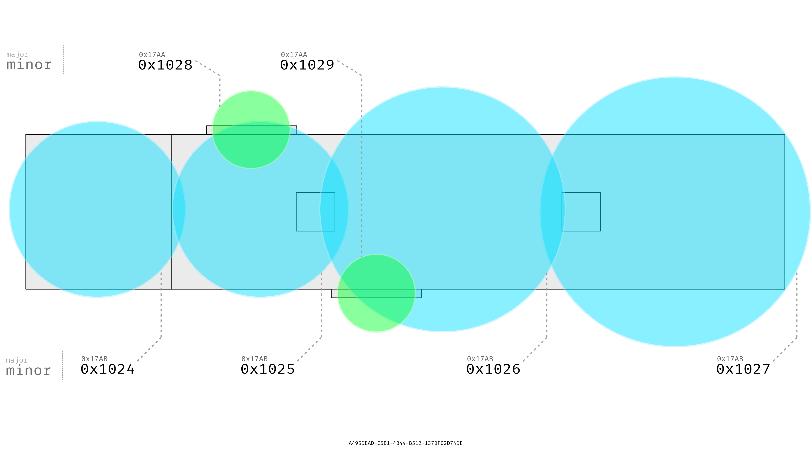

    

## What is this project?
iLabeacon is a proof-of-concept of an automatic attendance system using [iBeacons](https://developer.apple.com/ibeacon/). It uses the Innovation Lab (iLab) at [Pine Crest](http://pinecrest.edu) as a test location (hence the name iLabeacon).

## How does it work?

First, a user signs up with their Pine Crest School Google (Enterprise) account. They then are presented with a list of other users who've signed up, and whenever someone leaves or enters the iLab, their status ("Is In" or "Is Not In") is updated.

## No, no -- technically.

#### Hadware
We use a [PunchThrough Bean](https://punchthrough.com/bean) for the beacon hardware. First, we tried experimenting wiht [various](http://store.radiusnetworks.com/collections/all/products/radbeacon-x4) [directional](http://estimote.com/#) [beacons](http://gimbal.com/platform/gimbal-beacons/), in order to distinguish between when someone was standing right outside of the building, just passing through, or actually in.

The following diagram presents the original plan, with six beacons in total: 

It's great and all, except that just two beacons were enough to cover the width of the iLab, and any erroneous readings could later be corrected in software. :cold_sweat:

Speaking of which....

#### Software

Currently, the app uses **Firebase** as its back end, which allows for instant app updates. (Originally, Core Data was used alongside a custom PHP/MySQL server. That ~~horrible, horrible~~ code still lies in some of the earliest commits. Don't look at it.)

When users walk into the iLab, the app uses Beacon Monitoring in order to monitor the location event, and will (eventually) use Beacon Ranging to identify which beacon was triggered. When exiting, the same Monitoring is triggered, but again, Ranging will eventually be implemented to surpass the annoying 30s exit delay.

## Roadmap

See the Project page for tasks.

## Super Roadmap

Eventually, a Mac version of this app could be created that pulls data such as...
- Which parts of the iLab are most visited (or most used)
- What days of the week the iLab is most popular (and how long students spend on those days)
- Which projects were most recently worked on  

Additionally, it could perform administrative tasks, such as sending messages to users, adding/removing users, etc.

